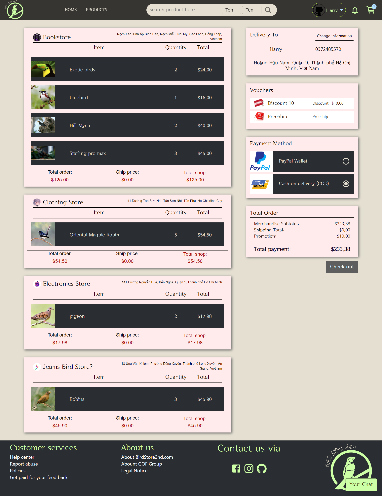

# Bird Trading Platform - Front End

The bird trading platform is a web application that allows users to search, buy, sell birds and food or accessories related to birds. It is designed for bird enthusiasts, breeders, and sellers who want a convenient platform to conduct transactions. The user interface design is created using Figma. The front-end of the platform is built using modern web development technologies such as ReactJS and SCSS. To handle user interactions, JavaScript is used along with Redux Toolkit, which provides efficient state management. Socket IO is used to create a real-time chatbox feature, enabling users to communicate with one another within the platform. The Material UI React component library is utilized to make the UI components consistent, easy to use, and accessible.

Overall, the bird trading platform provides a seamless user experience for buying, selling, and trading birds, making it an ideal solution for anyone interested in bird-related transactions.

## Technologies

The project incorporates the following technologies:

- JavaScript: It is a high-level programming language that allows to create dynamic and interactive web pages.
- ReactJS: It is a popular JavaScript library for building user interfaces. ReactJS allows to create reusable UI components and efficiently update the DOM based on changes in application state.

- Redux Toolkit: It is a set of tools that helps simplify the process of managing state in a React application. It provides a predictable and consistent way to manage and update application state, making it easier to build and maintain complex applications.

- Socket.IO: It is a JavaScript library that enables real-time, bidirectional communication between clients and servers. Socket.IO allows to build real-time chat systems.

- SCSS: It is a CSS preprocessor that allows to write CSS in a more organized and efficient way.

- Figma: It is a collaborative design tool that allows to work together to create and iterate on design mockups. Figma provides real-time collaboration, design libraries, and prototyping capabilities.

- Material UI: It is a popular React component library that provides pre-built UI components based on Google’s Material Design guidelines. Material UI allows to quickly and easily build responsive and attractive user interfaces, while also providing customization options to match a project's unique design needs.

- Google Maps API: It is a powerful and widely-used technology that provides us with access to various mapping and location-based services offered by Google.

## Link Demo

https://www.birdland2nd.store/

## Features

- The platform allows users to sign up and sign in using their Google accounts, as well as manage their accounts.
- It provides search and filtering options to help users easily find specific bird listings based on various criteria.
- Users can view product details and reviews, and directly chat with the shop owner for additional information about products.
- Adding products to the cart and updating it is made easy for the user.
- Apart from Cash on Delivery (COD), users can also pay via PayPal.
- The platform allows users to review their orders.
- Shop owners can easily view their shop's sales through statistical calculations presented in chart form.

## Screenshots

# Figma UI Demo 

# Sign In Feature

# Sign Up Feature

# Home Page Feature

# Product Page Feature

# Cart Feature

# Checkout Feature

## Contribution

This project was created by [harrycricket](https://github.com/harrycricket) (Huỳnh Văn Phướt) and [1wolfalone1](https://github.com/1wolfalone1) (Cao Nhật Thiên) . Contributions to the project are welcome. Feel free to submit bug reports, feature requests, or pull requests to enhance the functionality of the Bird Trading Platform - Front End.
